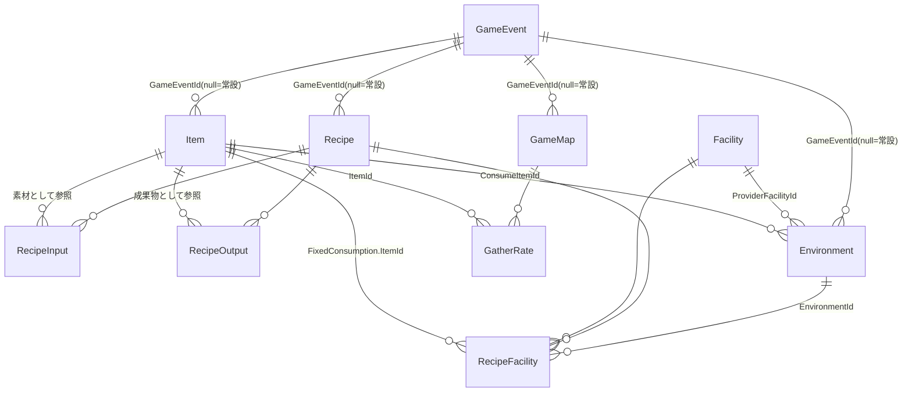
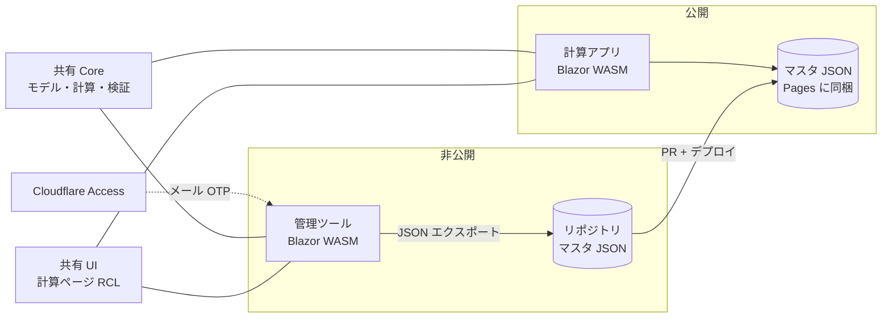

# 要件定義書: AIC 計算 Web アプリ（次期版）

バージョン: v1（新ドメインモデルの初版）
状態: 要件確定・実装済み（Phase 1〜8 マージ済み。Phase 9〜13 は仕様確定済み・未着手）
対象アプリ: アークナイツ：エンドフィールド AIC 計算 Web アプリケーション（`Tkg-tamagohan/Endfield-AIC-Web`）

> 本書は新規リポジトリでの作り直しを前提とした要件定義である。
> 旧リポジトリ [`Tkg-tamagohan/Endfield-AIC-Planner`](https://github.com/Tkg-tamagohan/Endfield-AIC-Planner)（WPF 版）は参考実装として凍結する。
> 確定した仕様上の判断は [decision-records.md](decision-records.md) を参照（新番号体系、旧決定は「旧 BA」のように参照）。
> 不確かなゲーム内仕様は「推測」と明記し、未決事項は「12. 未決事項」に集約する。

## 1. 背景と目的

「アークナイツ：エンドフィールド」の工業要素（AIC）において、目標アイテムの生産に必要な素材・設備・電力を逆算する Web アプリケーションを作る。
Cloudflare の無料枠内で構成する。

既存の WPF 版はレイアウト編集つきのデスクトップアプリとして実装済みだが、ゲーム側の新要素「環境」の登場などデータ構造の前提が変わったため、モデルを見直して作り直す。
本アプリは**レシピ計算に特化**し、工場設計（レイアウト・キャンバス）は対象外とする（仕様決定 K）。
設計はドメイン駆動設計を意識し、ドメイン層を UI・保存実装から分離する。

## 2. スコープ

### 2.1 v1 でやること

- 目標アイテム（複数可）に対する生産計算（必要素材・設備台数・消費電力の逆算）。
- レシピ×設備の多対多モデル（RecipeFacility）と、アイテム単位のレシピ・設備の代替選択。
- 副産物の他素材要求への充当、循環依存の検出と正味増循環の定常解（仕様決定 AQ）、余剰・警告の表示（仕様決定 R で継承）。
- 環境を前提としたレシピ計算。散布機の台数指定とガス消費の計上（仕様決定 I）。
- 設備の固定消費（稼働中に継続消費される動力素材）の計算への組込（仕様決定 J）。
- イベント限定要素（アイテム・環境・レシピ）の有効イベント指定による切替（仕様決定 T）。
- マップごとの採取上限レートに基づく採取計算（上限超過は代替レシピへ展開、代替不可は警告）と、計算ごとの利用可能レート指定（仕様決定 AC・AD・AE）。
- 毎秒・毎分レートに加え、日・時・分で指定した期間の個数換算（仕様決定 M）。
- 流量調整の「未調整／調整済」2 状態切替（仕様決定 O）。
- 計算結果の供給関係を有向グラフで表示する生産フローグラフ。WebGPU 対応環境で提供し、非対応環境はリスト表示のみ（仕様決定 AI・AK）。公開アプリと管理ツール計算プレビューの双方で提供する（仕様決定 BC）。粒子の密度はエッジ流量の絶対値に比例させ 30 個/分で飽和とし、流量差の見分けは粒子の速度が担う（仕様決定 AP）。ノードの層割りは、消費されないアイテム（目標アイテム・未消費の副産物・余剰）を Layer0 として出口側から上流へ遡る最長距離で決め、Layer0 を右端列に表示する（仕様決定 BF〜BH）。
- スマートフォンを含むレスポンシブ UI（仕様決定 K）。
- 管理者向けのマスタ登録ツール（別アプリ・非公開、仕様決定 E）。

### 2.2 v1 でやらないこと

- 工場レイアウト・キャンバス・共有レイアウト・自動配線。レイアウト由来のエンティティ（Layout・PlacedObject・CollisionClass）は持ち込まない（仕様決定 K）。
- 発電モデル。消費電力合計のみを出力する（仕様決定 Q、Y）。
- ユーザーアカウント・サーバー側への計算結果の保存・協調編集。
- PWA・オフライン対応（オンライン必須）。
- ゲーム公式との連携、収益化、広告。
- バージョン・進捗によるレシピのフィルタ UI（仕様決定 L）。

## 3. 利用者と公開範囲

- 計算アプリは公開・認証なし。対象は開発者本人と既知のプレイヤー（旧 BI 相当）。
- 管理ツールは非公開とし、Cloudflare Access で管理者のみがアクセスできる（仕様決定 E）。
- 非公式のファンツールとしてその旨を明記し、権利がクリアな画像のみを使用する（旧 AM 踏襲、仕様決定 R）。

## 4. 計算要件

### 4.1 計算の流れ

1. **目標設定**: アイテムと目標レート（個/分）を指定する。複数目標を指定できる（旧 D 踏襲）。目標の候補は、レシピの成果物として登場するアイテムのみとする（仕様決定 AT）。
2. **レシピ選択**: 需要アイテムごとに既定で `VersionAdded` 最新のレシピを選び、同率は実効出力レート（対象アイテムの 1 サイクル出力量 ÷ 適格ペアの最小 `CycleTime`）の高いレシピを優先し、さらなる同率は `Id` 昇順とする（仕様決定 F・BA）。設備は `CycleTime` 最小のペアを選ぶ。複数レシピ・複数設備がある場合はユーザーがアイテム単位で切り替えられる。同一レシピ×同一設備で属性の異なるペア行が複数ある場合は `CycleTime` 最小を既定とし、同率は `EnvironmentId=null` → `FixedConsumption` なし/小の順で優先する。代替選択はペア行単位で提示する（仕様決定 U）。
3. **需要展開**: レシピを仮実行して素材需要を逆算し、採取素材（`IsGatherable=true`）以外はさらに上流へ展開する。採取素材は選択マップの採取上限までを採取（外部調達）扱いとし、超過分は当該アイテムを産出するレシピへ展開する（§4.7、仕様決定 AD）。
4. **出力**: 素材・設備・電力・余剰・警告を表示する。環境利用時は散布機台数とガス消費も出力する。

- 計算実行の例外は UI が捕捉して入力エラー欄へ表示し、アプリの動作は継続させる（仕様決定 BE）。

### 4.2 需要と供給の扱い

- 目標アイテムの需要には、副産物（レシピの副次出力）を他素材の要求へ充当する。余剰が出れば余剰一覧に表示する（旧 K 踏襲）。
- 循環依存（素材が自身の生産を必要とする状態）は検出する。正味増循環（検出パス上の各レシピ比率の積が 1 未満）は、打ち切った残差を解放する固定点反復で外部投入なしの定常解を求める（仕様決定 AQ）。それ以外の循環・収束しない循環は警告を出し、該当需要を充足不能として扱う。循環の起動に必要な初期在庫は計算の対象外とする（仕様決定 AR）。
- 1 アイテムの需要を複数設備へ分割しない（旧 BE 踏襲）。設備台数は目標レート ÷ ペア出力の切上げとする。
- 計画内ではレシピ→設備を一意とする。衝突時は先に確定したペアを採用して警告を出す（旧 BN 踏襲）。
- 設備 1 ユニットへの入力流量がベルト 30 個/分・パイプ 60 個/分 を超える場合に警告を出す。超過自体は許容する（旧 L の容量警告部分を踏襲。単位は仕様決定 AM、判定基準は仕様決定 AN）。

### 4.3 環境

**環境**は、ガス等のアイテムを消費して特定範囲を「○○環境」とし、専用レシピを開放する新要素である。
現状の実データはガス散布機とガスの組み合わせのみ（推測: 今後種類が増える可能性があるため、エンティティとして一般化する）。

- 環境条件は RecipeFacility ペアの属性（`EnvironmentId`、null=不要）とする（仕様決定 H）。
- 環境を必要とするレシピを採用した場合、供給設備（散布機）を設備要件・消費電力に計上し、環境の消費アイテム（ガス等）×台数を需要へ追加する（仕様決定 I）。
- 散布機のカバー範囲（13×13 等）はレイアウト・工場系要素を持たないためモデル化しない。工場ドメインを再定義する際に必要になれば追加する（仕様決定 W）。
- 散布機の台数はユーザーが環境ごとに整数で指定でき、既定はその環境を必要とする稼働中レシピ数（レシピにつき 1 台）とする。1 台の散布機が複数レシピをカバーする運用は台数を減らすことで表現する（仕様決定 I）。
- 台数の入力値は再計算をまたいで保持するが、ペア変更などで自動上限が下がって保持値が上限を超えた場合は自動値へ戻し、直ちに整合後の入力で再計算する（仕様決定 AH）。
- 環境の消費アイテムの候補は「気体」「液体」カテゴリのアイテムのみとする（仕様決定 AT）。

### 4.4 固定消費

**固定消費**は、設備が稼働するだけで消費される動力素材（アイテムの生産効率にかかわらず消費される継続消費）である。
RecipeFacility ペアの要素（ItemId＋個/分、任意）として保持し、消費量を台数に比例させて需要へ追加する（仕様決定 J）。
台数の基準は切上台数（実設置台数）とし、調整済モードでも同じ基準とする（仕様決定 V）。
管理ツールの固定消費入力の候補は「気体」「液体」カテゴリのアイテムのみとする（仕様決定 AT）。

### 4.5 イベント

- `GameEvent` は `Id`・`Name`・`ActiveFrom`・`ActiveTo`（null=期間なし・常設）を持つ（仕様決定 T）。
- Item・Environment・Recipe・GameMap に `GameEventId`（null=常設）を持たせ、計算時に「有効なイベント」のコンテキストを指定できる。
- 非有効イベントのイベント限定アイテムは生産・外部調達とも不可とし、需要が残れば未充足＋警告とする。
- 非有効イベントのマップは選択不可とし、選択状態が残った場合は全採取素材を採取不可（上限 0）として警告し、採取レートのユーザー上書きも無効とする（仕様決定 AD）。
- 上記の「不可」扱いは確定仕様とする（仕様決定 X）。ゲーム仕様で異なる挙動が確認された場合に再検討する。
- `ActiveFrom`・`ActiveTo` は時刻の瞬間として解釈し、「Z」またはオフセット付き表記のみ有効とする（オフセット無しは検証エラー）。既定の有効判定は両端を閲覧者のローカル暦日で比較する（仕様決定 Z）。

### 4.6 流量調整

- 計算結果は「未調整（切上台数の最大稼働）」と「調整済（推奨流量制限で余剰を抑制）」の 2 状態を切り替えられる（仕様決定 O）。
- 目標レートがレシピ出力の整数倍でない場合、既定を調整済とする。

### 4.7 採取上限とマップ

**マップ**は、採取素材を採取できるゲーム内の場所である。マップごとに採取素材の採取上限レートを持つ（仕様決定 AC）。

- 計算時に 1 マップを選択できる。マップ未選択時は全採取素材を上限なしとする。
- マップの採取レート行は「毎分の上限値」または「無限」のいずれかを指定する。選択したマップに採取レート行のない採取素材は、そのマップでは採取不可（上限 0）とする。
- 需要が有効採取レート以内であれば採取（外部調達）扱いとし、超過分は当該アイテムを産出するレシピで展開する。代替レシピがなければ未充足＋警告とする（仕様決定 AD）。
- 採取上限は需要の発生源を問わず適用する（目標・レシピ入力・環境消費・固定消費のいずれ由来でも）。
- ユーザーは計算ごとに採取素材の利用可能レート（個/分）を指定できる。指定は有効レートの置き換えとし、空欄はマップ既定値とする。UI は散布機台数の指定と同型とする（仕様決定 AE）。
- 非有効イベントのマップは選択候補から外し、選択状態が残った場合は全採取素材を採取不可（上限 0）として警告する（仕様決定 AD、X と同型）。この場合の採取レート上書きは適用されない。

## 5. データモデル

### 5.1 エンティティ関係

### 5.2 共通属性

全マスタエンティティに次を持つ（仕様決定 N）。

| 属性 | 型 | 説明 |
|------|-----|------|
| Id | 文字列 | エンティティ種別内で一意の識別子 |
| Name | 文字列 | 表示名 |
| Description | 文字列 | 説明文（空可） |
| IconKey | 文字列 | アイコンマニフェストのキー（未設定可、フォールバック表示） |
| VersionAdded | 文字列 | 実装されたゲームバージョン |
| VersionRemoved | 文字列・null | 削除されたゲームバージョン（任意） |

管理ツールで新規追加するエンティティの `VersionAdded` 既定値は "1.0.0" とする（仕様決定 AV）。

### 5.3 Item

素材・中間品・イベント限定品など、生産・消費されるもの。

| 属性 | 型 | 説明 |
|------|-----|------|
| （共通属性） | — | 5.2 参照 |
| Category | 文字列 | 表示用の分類タグ。計算の判定には使わない |
| IsGatherable | 真偽値 | 需要展開の終端となる採取素材か。true なら採取（外部調達）扱い。選択マップの採取上限に従う（仕様決定 AC・AD） |
| TransportKind | None/Belt/Pipe | 輸送種別。None は電力等の仮想アイテム。容量警告の判定に使用 |
| GameEventId | 文字列・null | 所属イベント。非有効時は生産・外部調達とも不可（仕様決定 X） |

### 5.4 Environment

稼働に環境を要求するレシピを動かすための供給単位。

| 属性 | 型 | 説明 |
|------|-----|------|
| （共通属性） | — | 5.2 参照 |
| ProviderFacilityId | FacilityId | 環境を供給する設備（ガス散布機等） |
| ConsumeItemId | ItemId | 継続消費するアイテム（ガス等） |
| ConsumeRatePerMinute | 数値 | 消費速度（個/分。ガスなら 360） |
| GameEventId | 文字列・null | 所属イベント（イベント限定環境は現状存在しないが同型で用意） |

### 5.5 Recipe

アイテム同士の生産関係。

| 属性 | 型 | 説明 |
|------|-----|------|
| （共通属性） | — | 5.2 参照 |
| Inputs | RecipeInput[] | 素材（ItemId＋個数） |
| Outputs | RecipeOutput[] | 成果物（ItemId＋個数＋SortOrder。SortOrder=0 が主産物） |
| Facilities | RecipeFacility[] | 実行可能な設備とのペア |
| GameEventId | 文字列・null | 所属イベント |

### 5.6 Facility

レシピを実行する設備、および環境の供給設備。

| 属性 | 型 | 説明 |
|------|-----|------|
| （共通属性） | — | 5.2 参照 |
| Width / Height | 数値 | 設備の大きさ。「設備面積最小」最適化で使用する（仕様決定 F。パイプ・ベルトの経路は考慮しない） |
| PowerConsumption | 数値 | 消費電力 |

### 5.7 RecipeFacility（ペア）

レシピと設備の紐付け。一意性は全要素の組で判定する（仕様決定 P）。

| 属性 | 型 | 説明 |
|------|-----|------|
| RecipeId | RecipeId | 対象レシピ |
| FacilityId | FacilityId | 対象設備 |
| CycleTime | 数値 | このペアでの 1 サイクル秒数 |
| EnvironmentId | EnvironmentId・null | 稼働に必要な環境（null=不要） |
| FixedConsumption | (ItemId, 個/分)・null | 稼働中の継続消費素材（仕様決定 J） |

管理ツールで新規追加する設備ペア行の `CycleTime` 既定値は 2 とする（仕様決定 AW）。

### 5.8 GameEvent

| 属性 | 型 | 説明 |
|------|-----|------|
| Id / Name | 文字列 | 識別子・表示名 |
| ActiveFrom / ActiveTo | 日時・null | 期間。両 null は常設 |

### 5.9 GameMap

採取素材を採取できるゲーム内の場所。マップごとの採取上限を持つ（仕様決定 AC）。

| 属性 | 型 | 説明 |
|------|-----|------|
| （共通属性） | — | 5.2 参照 |
| GatherRates | GatherRate[] | このマップで採取できる採取素材と上限の一覧 |
| GameEventId | 文字列・null | 所属イベント（イベント限定マップは現状存在しないが同型で用意） |

`GatherRate` は採取素材 1 件ごとの行で、次の構造を持つ。

| 属性 | 型 | 説明 |
|------|-----|------|
| ItemId | ItemId | 採取対象の採取素材（`IsGatherable=true` のみ。同一マップ内で重複不可） |
| IsUnlimited | 真偽値 | true なら上限なしで採取可能 |
| RatePerMinute | 数値 | 採取上限（個/分。`IsUnlimited=false` のとき必須で有限の正値） |

### 5.10 マスタ文書

- ルートに `SchemaVersion`・`DataVersion` を持ち、Items・Facilities・Environments・GameEvents・Recipes・Maps・Icons を収める。
- スキーマは新系統で v1 に振り直す（仕様決定 C）。`DataVersion` はデータ更新で上げる。

### 5.11 Icons（アイコン）

- エンティティのアイコンはマニフェスト（Icons 節）と画像ファイルで管理する。File は `icons/<Key>.png` 固定、Sha256・Bytes は実ファイルとの一致を保持する。
- Key は `^[A-Za-z0-9_-]{1,64}$` とする（ファイル名導出の前提）。エンティティの IconKey は未設定（null または空文字）を許容し、設定時は同じ文字種とする。
- 画像は管理ツールで登録する際にブラウザ内で正規化する。静止画は中央正方形にクロップしたうえで、クロップ領域が 128 ピクセルを超える場合は 128×128 へ縮小、以下の場合は拡大もパディングもせず原寸の正方形のまま保存する（仕様決定 AA）。アニメーション画像（GIF・APNG 入力）は全フレームへ同一規則を適用して APNG で保存し、File・MIME の規約は PNG と同じ `icons/<Key>.png`・`image/png` とする（仕様決定 AA）。
- IconKey 未設定・解決不能の場合はプレースホルダ表示とする。

## 6. アーキテクチャ

### 6.1 構成

- 計算アプリ・管理ツールともに Blazor WebAssembly（スタンドアロン、.NET 8）とし、Cloudflare Pages で静的配信する（仕様決定 B）。
- 計算ページの UI は両アプリ共通の Razor Class Library（`EndfieldAicWeb.SharedUi`）に集約し、両ページはマスタ読み込みのゲートのみを持つ（仕様決定 BB）。
- 両アプリ共通のグローバルスタイル（テーマトークン・汎用クラス）は同 RCL の `wwwroot/css/shared.css` に集約し、`_content/` 経由で配信する。各 `app.css` はアプリ固有のルールのみを持つ（仕様決定 BI）。
- 管理ツールは別 Pages（専用ドメイン）にデプロイし、Cloudflare Access（Zero Trust 無料枠、メール OTP）で管理者のみに制限する（仕様決定 E）。
- Workers・D1 は持たない。共有データが復活した時点で追加を再検討する（仕様決定 B）。

### 6.2 レイヤー

ドメイン駆動設計を意識し、次のレイヤーに分ける。

| レイヤー | 責務 | 依存 |
|----------|------|------|
| Domain | エンティティ・値オブジェクト・計算ロジック・検証 | 外部依存なし（旧 Core 移植） |
| Application | ユースケース（計算実行・マスタ編集・エクスポート） | Domain |
| Infrastructure | JSON 読み書き・アイコンマニフェスト | Domain |
| Web | Blazor WASM UI（計算アプリ・管理ツール）。計算ページ UI は両アプリ共有の Razor Class Library `EndfieldAicWeb.SharedUi` に集約する（仕様決定 BB） | Application |

既存 Core は外部依存ゼロの net8.0 で WASM 上で実行可能なため、モデル・計算・検証を C# のまま移植する（仕様決定 C）。
EF Core・SQLite・Layout・WPF・旧 JSON 相互互換は移植しない。

- ドメインエンティティ（`MasterDocument` 配下）の可変性は管理ツールの編集対象に限定する。計算経路は必ずスナップショット経由とし、編集画面の可変モデルを計算へ流用しない。スナップショットの「不変」はコレクションの複製と呼び出し側の変更禁止という運用上の境界であり、エンティティ自体は共有参照である。

## 7. データ投入ワークフロー

1. 管理者が管理ツールでマスタ JSON を読み込み（デプロイ済みまたはファイル選択）。
2. ブラウザ内でエンティティを編集し、保存時に整合性検証を実行（参照整合・ペア一意・仮想アイテム規則等、旧 Z 相当を継承）。
3. 計算プレビューで投入データの妥当性を確認（旧 BQ 相当）。
4. JSON をエクスポートしてリポジトリへコミットし、PR でレビュー・CI 検証後にマージ。
5. Pages のデプロイで公開アプリに配信される。

## 8. 非機能要件

- Cloudflare 無料枠内（Pages 静的配信・Access Zero Trust 50 ユーザーまで）で運用する。超過時は有料化せず機能制限を検討する（旧 BK 相当）。
- オンライン必須とし、オフライン対応はしない。
- 生産フローグラフはブラウザの WebGPU 機能のみに依存し、追加の配信設定やサーバー要素を要しない。非対応環境へはリスト表示で代替し、グラフが出ないこと自体をエラーとして扱わない（仕様決定 AK）。
- UI は日本語のみ。スマートフォンを含むレスポンシブ対応（仕様決定 K）。
- すべての素材入力・アイテム検索窓でカテゴリによる絞り込みを行え、カテゴリ欄とアイテム欄を横並びに配置する（仕様決定 AS）。選択窓はネイティブ select で統一し、公開アプリのテキスト検索コンボも同型へ置き換える（仕様決定 AU）。空値ラベルは「カテゴリ」「アイテム」とする（仕様決定 AX）。候補の母集団は欄の用途に従う（仕様決定 AT）。
- 期間入力（日・時・分）と個/分のレート入力の欄幅は、3 桁の入力に余裕がある程度に抑える（仕様決定 AY）。
- 生産リストの新規行のレート既定値は 30 個/分とする（仕様決定 AZ）。
- 権利がクリアな画像のみを使用し、非公式ファンツールである旨を明記する。

## 9. テスト方針

- Domain の計算・検証ロジックは単体テストを移植し、環境・固定消費の新規分を追加する。
- JSON スキーマの整合性は検証テストで担保する。
- 公開アプリ・管理ツールのブラウザ動作は手動または E2E で確認する。

## 10. 用語

| 用語 | 説明 |
|------|------|
| 環境 | ガス等のアイテムを消費して範囲内の設備へ専用レシピを開放する要素 |
| 散布機 | 環境を供給する設備（ガス散布機等）。ProviderFacilityId で参照される |
| 固定消費 | 設備が稼働するだけで消費される動力素材（生産効率にかかわらない継続消費） |
| ペア | RecipeFacility。レシピ×設備×サイクル時間×環境条件×固定消費の組 |
| 採取素材 | `IsGatherable=true` のアイテム。需要展開の終端で採取（外部調達）扱い。選択マップの採取上限に従う。計算ページ等の UI 表示では「天然資源」と表記し、マスタ JSON の Category 値と警告メッセージは「採取素材」のままとする（仕様決定 BD） |
| マップ | 採取素材を採取できるゲーム内の場所（GameMap）。採取素材ごとの採取上限を持つ |
| 採取上限 | 選択マップにおける採取素材の取得上限（個/分または無限）。超過分は代替レシピで賄い、不可なら警告とする |
| 仮想アイテム | `TransportKind=None` のアイテム（電力等）。輸送容量の対象外 |

## 11. 関連ドキュメント

- [decision-records.md](decision-records.md): 仕様上の判断事項（新番号体系）
- 旧リポジトリの決定記録: [`Endfield-AIC-Planner` docs/decision-records.md](https://github.com/Tkg-tamagohan/Endfield-AIC-Planner/blob/dev/webification/docs/decision-records.md)（「旧 BA」等で参照）

## 12. 未決事項

確定を要するが協議未了、またはゲーム仕様の確認が必要な項目。
決まり次第 decision-records.md に移す。

現在未決事項はない。
